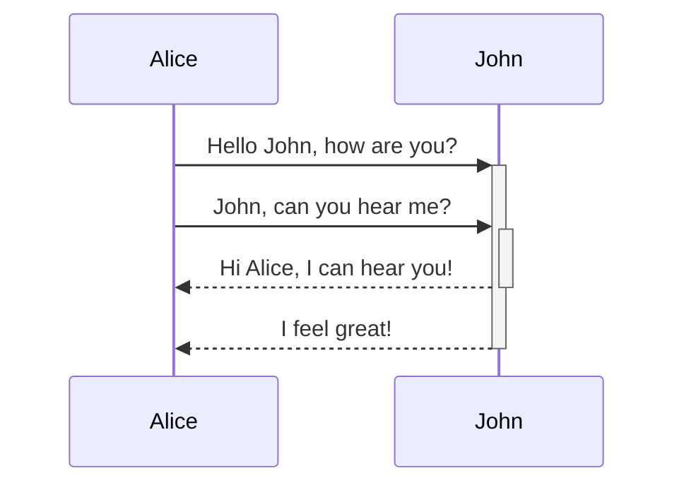
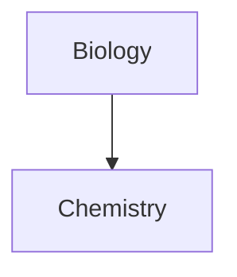

This page will display information regarding syntax

# Code

```javascript
function greet(name) {
  console.log(`Hello, ${name}!`)
}

// Example usage:
greet("World") // Output: Hello, World!
```

```javascript title="Greeting Function"
function greet(name) {
  console.log(`Hello, ${name}!`)
}
```

```javascript {1-2}
function greet(name) {
  console.log(`Hello, ${name}!`)
}
```

```javascript /console.log/
function greet(name) {
  console.log(`Hello, ${name}!`)
}
```

# Callouts

> [!faq]- Are callouts foldable?
> Yes! In a foldable callout, the contents are hidden when the callout is collapsed.

> [!note]
> Lorem ipsum dolor sit amet

> [!abstract]
> Lorem ipsum dolor sit amet

> [!info]
> Lorem ipsum dolor sit amet

> [!todo]
> Lorem ipsum dolor sit amet

> [!tip]
> Lorem ipsum dolor sit amet

> [!success]
> Lorem ipsum dolor sit amet

> [!question]
> Lorem ipsum dolor sit amet

> [!warning]
> Lorem ipsum dolor sit amet

> [!failure]
> Lorem ipsum dolor sit amet

> [!danger]
> Lorem ipsum dolor sit amet

> [!bug]
> Lorem ipsum dolor sit amet

> [!example]
> Lorem ipsum dolor sit amet

> [!quote]
> Lorem ipsum dolor sit amet

# Table

| First name | Last name |
| ---------- | --------- |
| Max        | Planck    |
| Marie      | Curie     |

```text title="The text below will output the above"
First name | Last name
-- | --
Max | Planck
Marie | Curie
```

| First column            | Second column |
| ----------------------- | ------------- |
| [[Sample\|Sample Page]] |               |

| Left-aligned text | Center-aligned text | Right-aligned text |
| :---------------- | :-----------------: | -----------------: |
| Content           |       Content       |            Content |

```text title="The text below will output the above"
Left-aligned text | Center-aligned text | Right-aligned text
:-- | :--: | --:
Content | Content | Content
```

# Mermaid





$$
\begin{vmatrix}a & b\\
c & d
\end{vmatrix}=ad-bc
$$

# This is a heading 1

## This is a heading 2

### This is a heading 3

#### This is a heading 4

##### This is a heading 5

###### This is a heading 6

**Bold text**

_Italic text_

~~Striked out text~~

==Highlighted text==

**Bold text and _nested italic_ text**

**_Bold and italic text_**

[Obsidian Help](https://help.obsidian.md)

# Image


# Quote

> Human beings face ever more complex and urgent problems, and their effectiveness in dealing with these problems is a matter that is critical to the stability and continued progress of society.

\- Doug Engelbart, 1961

# List

- First list item
- Second list item
- Third list item

1. First list item
2. Second list item
3. Third list item

# Checkbox

- [x] This is a completed task.
- [ ] This is an incomplete task.

1. First list item
   1. Ordered nested list item
2. Second list item
   - Unordered nested list item

- [ ] Task item 1
  - [ ] Subtask 1
- [ ] Task item 2
  - [ ] Subtask 1

---

Text inside `backticks` on a line will be formatted like code.

This is a simple footnote[^1].

[^1]: This is the referenced text.

[^2]:
    Add 2 spaces at the start of each new line.
    This lets you write footnotes that span multiple lines.

[^note]: Named footnotes still appear as numbers, but can make it easier to identify and link references.
